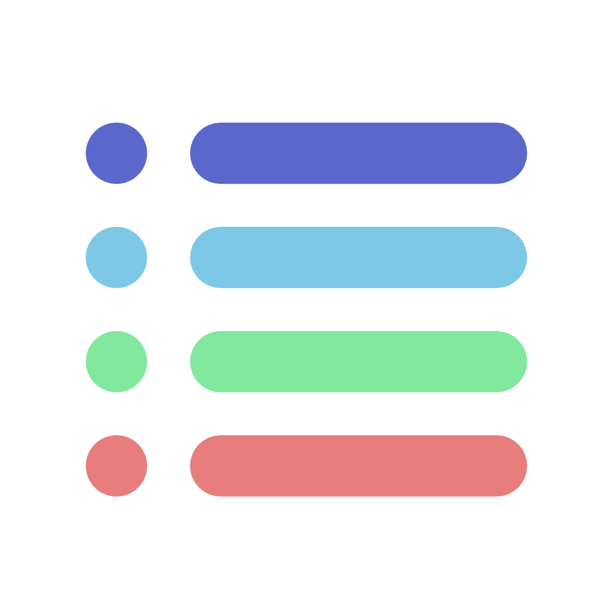
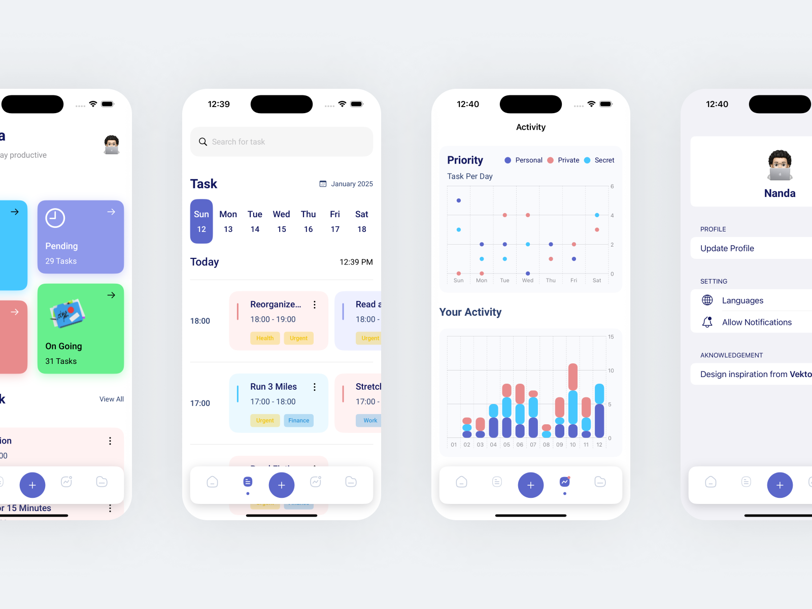
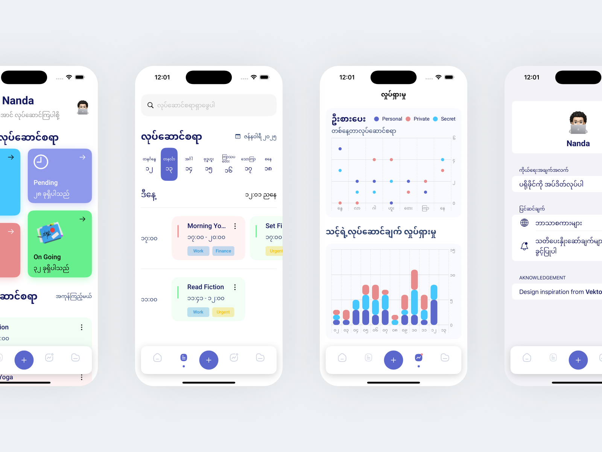
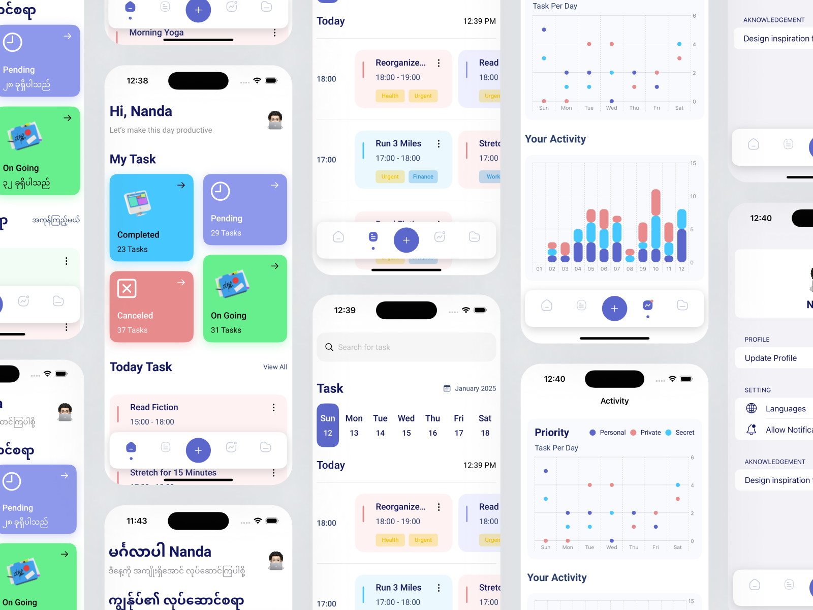
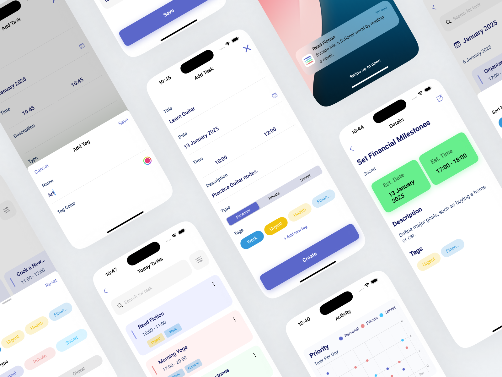

<p align="center">
   
</p>

<h1 align="center">Dailoz</h1>

<p align="center">
    
    
    
</p>

Dailoz is a beautifully designed and feature-rich task management app built with **SwiftUI** and **Core Data**. It empowers users to stay organized, track tasks, and visualize their productivity with an intuitive user interface and insightful analytics.

<div align="center">
    
    
    
    
</div>

## Features

- **Launch Screen**: On the first launch, the app asks for user permission for local notifications and requests the user's name.
- **HomeScreen**: Displays a brief task count based on their status such as pending, ongoing, completed, and canceled. It also shows a small list of tasks.
- **TaskOverviewScreen**: Allows users to search for tasks by name or description. Users can use a weekly slider date picker to see the task list, which is grouped by time range horizontally and shows tasks by hour vertically.
- **ActivityScreen**: Displays a point mark chart of weekly data for the current date. Below the chart is a bar chart showing task data for the current date and the previous 12 days.
- **ProfileScreen**: Users can change their name, change the app language, and enable/disable app notifications.
- **TaskPlanScreen**: Users can create new tasks or modify existing ones. They can also create, modify, or delete tags. Tags indicate the relationship of a task.
- **TaskHistoryScreen**: Shows a list of tasks based on search text and filter results, displaying monthly tasks instead of just one day.
- **Task List Card**: Users can delete tasks or change their status.
- **TaskDetailScreen**: Users can view detailed information about a task.
- **Custom Tabbar**: Features show and hide behavior.
- **Charts**: Includes points chart and bar charts for user task activity.

## Project and Technologies

- **SwiftUI**: Utilized for building the user interface.
- **Core Data**: Used for data persistence and management.
- **Swift 5.9**: The project is built using Swift version 5.9.
- **SwiftFormatter**: Used for easy code formatting.
- **Localization**: Supports multiple languages, including English and Myanmar (Burmese) using Apple's latest xcstrings catalog API.
- **Local Notifications**: Support in app local notifications.

## Architecture

The app uses the MVVM+Repository pattern:

- **ViewModel**: Each screen has its own ViewModel that interacts with the Repository class.
- **Repository**: Acts as a bridge between the data source and the ViewModel. It transforms data for the UI and Core Data.
- **DataSource**: Where Core Data operations occur.

## Installation

To get started with the project:

1. Clone the repository:
    ```bash
    git clone https://github.com/nanda-wk/Dailoz.git
    ```
2. Open the project in Xcode:
    ```bash
    cd Dailoz
    open Dailoz.xcodeproj
    ```
3. Build and run the project in Xcode.

## License

This project is licensed under the MIT License - see the [LICENSE](LICENSE) file for details.

## Acknowledgements

- Design inspiration from [Vektora Studio](https://www.sketchappsources.com/free-source/4757-to-do-daily-activities-app-sketch-freebie-resource.html).
